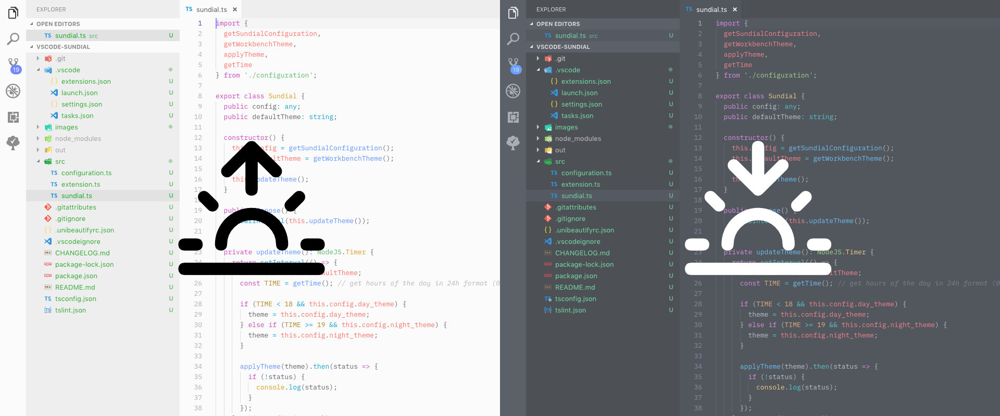

# Sundial (vscode-sundial)

Sundial changes your theme based on your day and night cycle. It is inspired by the [OSX Mojave dynamic backgrounds](https://www.apple.com/de/macos/mojave/) and [Nigth Owl for Mac](https://nightowl.kramser.xyz/). It should _reduce eye pain_ when working in the night or on the day. Humans should not strain their eyes too much, it's **not recommended** to have a light theme in the night and vice versa.

Whenever you have ideas for this project, things you would like to add or you found a bug, feel free to create an issue or start contributing! 😇

## ⚙️ Extension Settings

**Sundial** contributes the following settings:

* `sundial.dayTheme`: name of the theme of choice for your day work. (default: `Default Light+`)
* `sundial.nightTheme`: name of the theme of choice for your night work. (default: `Default Dark+`)
* `sundial.sunrise`: set a time when your day starts in _24 hours format_. (default: `07:00`)
* `sundial.sunset`: set a time when your night starts in _24 hours format_. (default: `19:00`)
* `sundial.interval`: set a interval in which sundial should check the time. (default: `5`)

> If you set the interval to zero (0) sundial will not periodically check the time but still
> when you `ChangeWindowState`, `ChangeActiveTextEditor` and `ChangeTextEditorViewColumn`.

To get your sunrise and sunset automatically you can set these parameters:

* `sundial.latitude`: your latitude
* `sundial.longitude`: your longitude
* `sundial.autoLocale`: automatically set your sunset and sunrise based on your public ip location. (this may slow your VSCode a little, but I have not tested the performace yet)

> Get your latitude and longitude from [IPLocation Finder](https://www.iplocation.net/).

## 🛠 Development

1. Install packages via `npm i`
2. Set `sundial.debug` to `true`
3. Run debugger